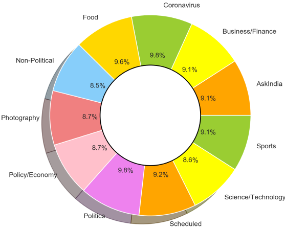

# Reddit-Flair-Detector-Application <a href="https://reddit-realtime-analysis.herokuapp.com/"></a>

Reddit-Flair-Detector-Application

1. **Web-Application** is live at https://reddit-realtime-analysis.herokuapp.com/

2. **Automated Testing** URL at https://reddit-realtime-analysis.herokuapp.com/automated_testing

3. **Jupyter Notebook** at https://github.com/abhisheksaxena1998/Reddit-Flair-Detector-Application/tree/master/Jupyter%20Notebooks

## To use automated_testing

**Automated Testing** URL at https://reddit-realtime-analysis.herokuapp.com/automated_testing

**Python Code for automated_testing :** 

```
import requests

r = requests.post("https://reddit-realtime-analysis.herokuapp.com/automated_testing", files = {'upload_file': open('s.txt', 'rb')})
print (r.text)    
```

  

## Terms used in collected Dataset

1. Preprocessed Text=Text with bogus symbols " ! ? / , @ : " removed.
2. Combined Text = Preprocessed Text of URL + Title + Comments.
3. Cleaned Text = Preprocessed text with STOPWORDS like " the,I,was,were " removed using "en_core_web_sm" module of [Spacy Library](https://spacy.io/).

## Steps Followed : 

1. Part I   - Reddit Data Collection (https://github.com/abhisheksaxena1998/Reddit-Flair-Detector-Application/blob/master/Jupyter%20Notebooks/Part%20I%20-%20Reddit%20Data%20Collection.ipynb) : 
   Using PRAW a total of 2552 posts are collected from 11 flairs listed as AskIndia, Business/Finance, Coronavirus, Food, Non-Political Photography, Policy/Economy, Politics, Scheduled, Science/Technology, Sports.
   <div style="text-align:center"></div>
   

2. Part II  - Exploratory Data Analysis (EDA) (https://github.com/abhisheksaxena1998/Reddit-Flair-Detector-Application/blob/master/Jupyter%20Notebooks/Part%20II%20-%20Exploratory%20Data%20Analysis%20(EDA).ipynb) : On Cleaned and Processed Data Temporal and EDA is performed 

3. Part III - Building a Flare Detector (https://github.com/abhisheksaxena1998/Reddit-Flair-Detector-Application/blob/master/Jupyter%20Notebooks/Part%20III%20-%20Building%20a%20Flair%20Detector.ipynb) : Using various classifiers as listed below a flair classifier is built and SGDClassifier is used in Web-Application. This works quite well in classifying real world posts.

4. Part IV  - Building a Web Application : A Web-Application is built to predict flair of a r/india post. Application has an input field which prompts a link to a reddit post from r/india. On submission it predicts the flair of the post.

Web application should also has an endpoint called /automated_testing. This endpoint will
be used for testing performance of the classifier. We will send an automated POST request to
the end point with a .txt file which contains a link of a r/india post in every line. Response of the
request should be a json file in which key is the link to the post and value should be predicted
flair.

5. Part V   - Deployment : The Django application is deployed on heroku at https://reddit-realtime-analysis.herokuapp.com/


## Classifiers used :

SVM, MLP, MultinomialNB, SGDClassifier, Logistic Regression, RandomForest

## Accuracy of various Classifiers :

Classifier | Cleaned Text | Combined Features | Processed URL | Processed Title
------------ | ------------- | ------------ | ------------- | ------------- 
SVM | 0.79 | 0.72 | 0.47 | 0.65
MLP |0.61	| 0.61 | 0.42 | 0.54
MultinomialNB | 0.61 | 0.57 | 0.40 | 0.58
SGDClassifier | 0.80 | 0.79 | 0.49 | 0.66
Logistic Regression | 0.76 | 0.74 | 0.47 | 0.65
RandomForest | 0.75 | 0.71 | 0.44 | 0.63


## Installation Guide

1.  Extract Reddit-Flair-Detector-Application zip file.
2.  In Reddit-Flair-Detector-Application folder there is a file requirements.txt
3.  Open Command Prompt in Reddit-Flair-Detector-Application folder.
  
      

4.  Type following command in cmd.

    

5.  To run the code, write following command in terminal.

    python manage.py runserver
    
    

6.  Type http://127.0.0.1:8000/ in URL bar of browser and press Enter. Machine Learning powered Web-Application will start.  

    

## Usage : 

1.  Type URL in text bar and click on GET REALTIME ANALYSIS.

    
    
2.  Link for automated testing is: https://reddit-realtime-analysis.herokuapp.com/automated_testing

3.  Upload a text file which contains a link of a r/india post in every line and click on GET PREDICTIONS.

    
    
    

4.  The result is a JSON file as depicted here.

    
    
        
## Approach Followed

1.  Fetch data from r/india subreddit.
2.  Clean the data for bogus symbols like " , ! ( ) ? " combine features, remove stopwords using Spacy.
3.  Train using combined features through SGDClassifier.
4.  Save the classifier for using it in the Web-Application.
5.  Predict the flair, through subreddit URL.

## About Application

1. Data Analysis section at : https://reddit-realtime-analysis.herokuapp.com/dataanalysis

    

2. Data that is searched through this application is stored in a database : https://reddit-realtime-analysis.herokuapp.com/geturlhistory

    
    
3. Themes discussed in each flair are depicted at : https://reddit-realtime-analysis.herokuapp.com/themes

    
